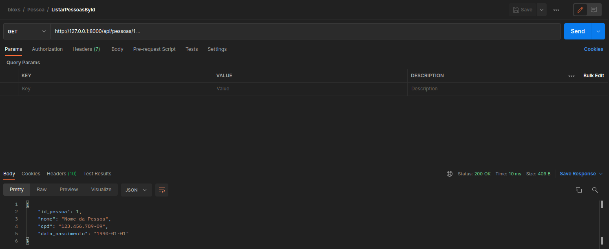

# Backend Django Rest Framework - README

## Overview

This repository contains the backend implementation for a financial application using Django Rest Framework. The backend is organized into three main classes: `Pessoa`, `Account`, and `Transacao`. Additionally, it includes authentication functionalities through the `Auth` class.

### Technologies Used

- Django Rest Framework
- Python 3.8

## Endpoints

### Pessoa

1. **Criar uma Pessoa**
   - Endpoint: `/api/pessoas/criar/`
   - Method: `POST`
   - Description: Cria uma nova pessoa.

2. **Listar Todas as Pessoas**
   - Endpoint: `/api/pessoas/listar/`
   - Method: `GET`
   - Description: Retorna uma lista de todas as pessoas cadastradas.

3. **Listar uma Única Pessoa**
   - Endpoint: `/api/pessoas/{id}/`
   - Method: `GET`
   - Description: Retorna os detalhes de uma única pessoa com base no ID.

   
### Account

4. **Criar uma Conta**
   - Endpoint: `/api/accounts/criar/`
   - Method: `POST`
   - Description: Cria uma nova conta.

5. **Listar Todas as Contas**
   - Endpoint: `/api/accounts/listar/`
   - Method: `GET`
   - Description: Retorna uma lista de todas as contas cadastradas.

6. **Listar Conta por ID**
   - Endpoint: `/api/accounts/{id}/`
   - Method: `GET`
   - Description: Retorna os detalhes de uma conta com base no ID.

### Transacao

7. **Realizar Transacao**
   - Endpoint: `/api/transacoes/realizar/`
   - Method: `POST`
   - Description: Realiza uma transação, com o tipo especificado (SAQUE ou DEPOSITO). Se for SAQUE, o valor é deduzido; se for DEPOSITO, o valor é aumentado. Retorna o extrato da transação.

8. **Extrato da Transacao**
   - Endpoint: `/api/transacoes/extrato/{id}/`
   - Method: `GET`
   - Description: Retorna o histórico de transações para uma conta específica.

### Auth

9. **Login**
   - Endpoint: `/api/auth/login/`
   - Method: `POST`
   - Description: Realiza o login e retorna o token de acesso.

10. **Token**
    - Endpoint: `/api/auth/token/`
    - Method: `POST`
    - Description: Retorna o token de acesso e o token de atualização.

11. **Refresh Token**
    - Endpoint: `/api/auth/refresh-token/`
    - Method: `POST`
    - Description: Atualiza o token de acesso usando o token de atualização.

## Getting Started

1. Clone this repository.
2. Install the required dependencies using `pip install -r requirements.txt`.
3. Run the development server using `python manage.py runserver`.

Feel free to explore the various endpoints and functionalities provided by the backend.

**Note:** Ensure that you have a working knowledge of Django Rest Framework and have set up the necessary configurations and database connections before running the server.
